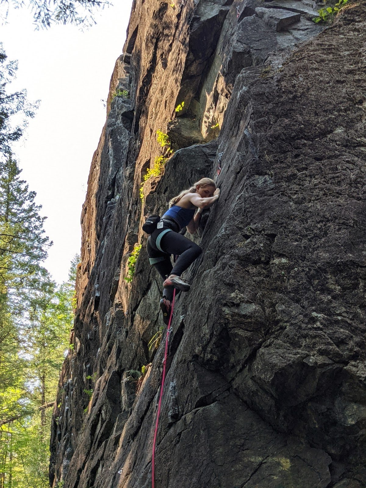

<h1>
About Me
</h1>

<h5>

Rock Climbing is my favorite hobby!

</h5>

<h2>Hey folks!</h2>
I was six years old when I first was exposed to the wonders of programming. My parents introduced me to Scratch, a visual programming language designed for children. 
I remember not quite being able to wrap my mind around the fact that I, a mere human, could compel the computer to follow my commands. 
Throughout the rest of my childhood, the mediums through which I excercised this mysterious power changed, from Khan Academy Javascript lessons to creating my own pasta-themed platform game in Godot, but the wonder remained.
Even now, as I have nearly finished my degree in Computer Science, I still find myself in awe of the power and versatility of computing. 
As I prepare to step into the professional world of software engineering, I am excited to continue to learn more about programming and to be able to use that knowledge in interesting and innovative ways!

#### Education: 
B.S. Computer Science 2022 - University of Florida

#### Favorite Classes:
1. CIS4930 Competitive Programming
2. COP3530 Data Structures & Algorithms
3. COP4020 Programming Language Concepts
4. CIS4301 Information & Database Systems

#### Favorite Ways to Spend an Afternoon:

- Programming
- Rock Climbing
- Playing Dungeons & Dragons
- Cooking

