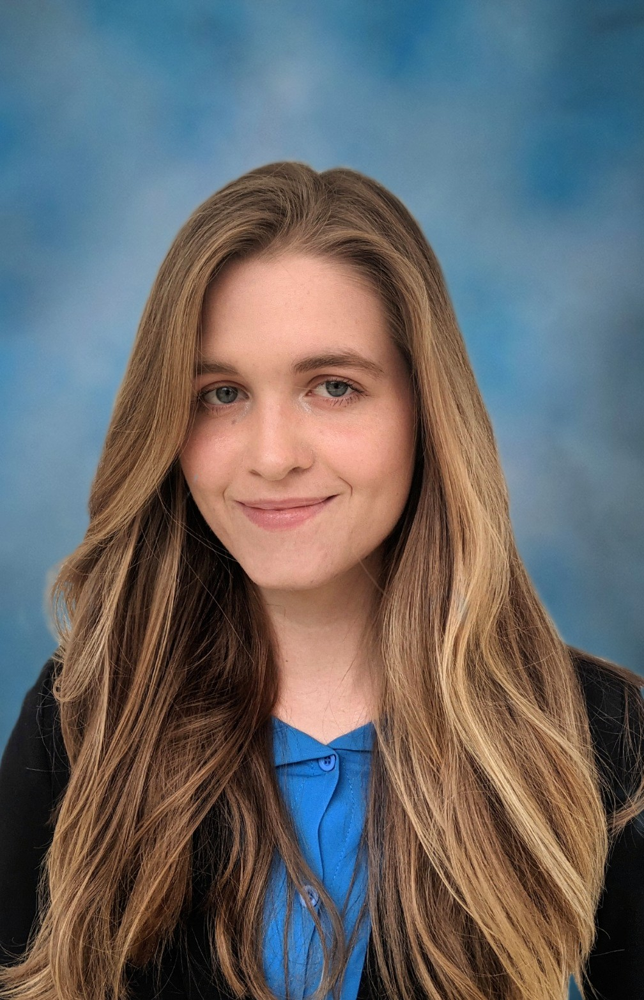

 
 
 
 
 

<h1>
Rachel Dowell
</h1>

 <link rel="stylesheet" href="./style.css">

<h2>

<a href="https://racheldowell.github.io/about">About Me</a>

</h2>

<h2>Welcome!</h2> 
I'm Rachel, a Spring 2022 Computer Science Graduate who likes developing streamlined, maintainable code.
  
<h2>What I've Been Up To</h2>
<h4>GatorVR</h4>
As President of the University of Florida's VR/AR Club this year, I've been busy working with my fellow officers to foster a community excited about these technologies.

<iframe width="560" height="315" src="https://www.youtube.com/embed/D2obOlpb0CU" title="YouTube video player" frameborder="0" allow="accelerometer; autoplay; clipboard-write; encrypted-media; gyroscope; picture-in-picture" allowfullscreen></iframe>
 

 

<h4>University of Florida Game-based Learning and Digital Experiences (GLaDE) Lab</h4>
For the Spring and Summer semesters of 2021, I worked as a member of UF's GLaDE Lab, helping develop an educational VR replica of a heating and cooling plant.

 

<h4> CoronaCast <a href="https://github.com/amills12/CoronaCast">(Github)</a> </h4>
In 2020, I worked together with three fellow University of Florida students to create a Covid-19 tracking email subscription service to help users monitor current Covid-19 trends in a chosen area.

> CoronaCast is a web application for seeing daily case and death statistics along with a statistical analysis and prediction of future trends for any county in the United States. CoronaCast uses various APIs on both the client and server sides of the application to handle requests and storage of user credentials. The application features an easy-to-use interface for signing up, changing settings, and accessing web-page reports. Users can further opt-in and opt-out of receiving emails of CoronaCast statistics for the county of their choice. The application also features an admin page for developers to view CoronaCast users, edit their saved user information, and remove users.
> <h4> Tools Utilized </h4>
> 
> - CircleCI
> 
> - MERN Stack
> 
> - Scrum development methodologies

